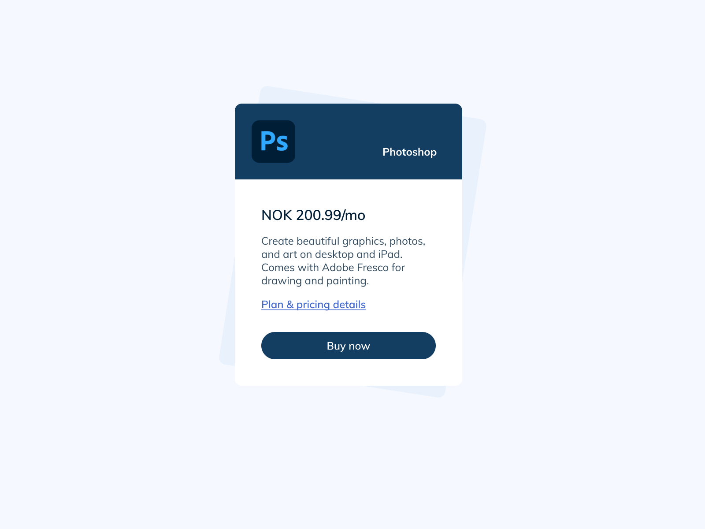
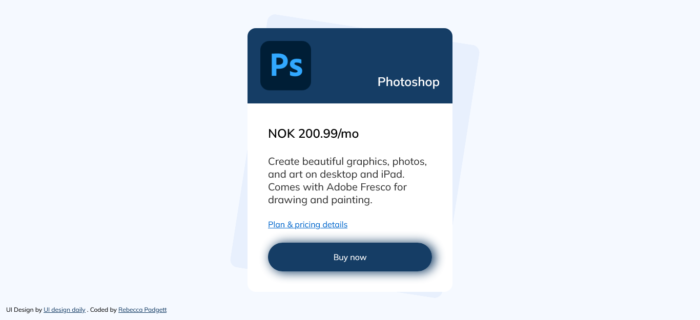

# UI Design Daily - Pricing Card

This is a solution to [UI Design Daily - Pricing Card](https://uidesigndaily.com/posts/figma-pricing-card-day-1534) on UI Design Daily

## Table of contents

- [Screenshot](#screenshot)
- [Demo](#demo)
- [My process](#my-process)
  - [Built with](#built-with)
  - [Useful resources](#useful-resources)
- [Author](#author)

### Screenshot

## Demo

- Live Website URL: [Github Pages]()

## My process

### Built with

### Useful Resources

- [Web code tools](https://webcode.tools/css-generator/box-shadow) - CSS Generator for box shadow
- [Favicon](https://favicon.io/) - Official website to make your own favicon icon

## Author

